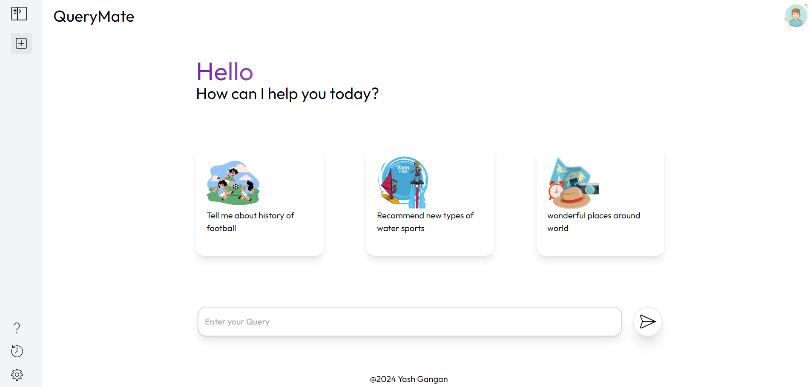

# 🤖 Querymate: AI Chatbot Powered by Gemini

**Querymate** is an intelligent chatbot designed to provide quick and accurate responses to user queries. Built with **React**, **Tailwind CSS**, and **Axios**, it leverages the power of **Gemini AI** for natural language understanding.

   

## 🚀 Live Demo

Check out the live demo here: [Querymate Live Demo](https://querymate-eta.vercel.app/)

## ✨ Features

- 💬 **Conversational AI**: Querymate provides real-time, intelligent responses using **Gemini AI**.
- ⚡ **Fast & Efficient**: Seamless HTTP requests using **Axios** for rapid interaction.
- 🎨 **Sleek Design**: Designed with **Tailwind CSS** for a clean and responsive UI.
- 📡 **API-Powered**: Utilizes **Gemini AI** for natural language processing and comprehension.

## 🛠️ Tech Stack

- **Frontend**: React, Tailwind CSS
- **API Handling**: Axios
- **AI Integration**: Gemini AI
- **State Management**: React Hooks
- **Deployment**: Vercel

